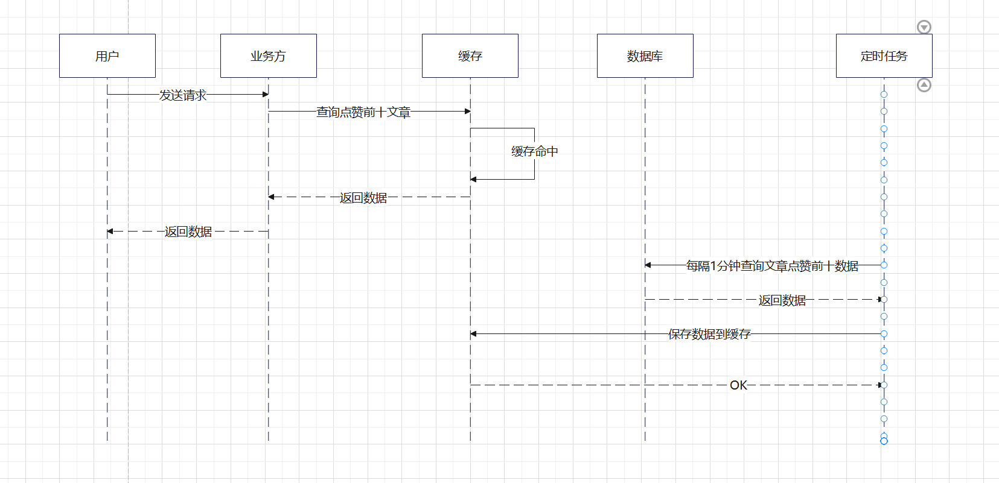

## 序列图
命中缓存

未命中缓存

## 业务折中
通过定时任务每隔一分钟查一次数据库的将点赞数topN的数据缓存到redis,
从缓存中查到的点赞数topN的数据与实时的点赞数情况最多有一分钟的时间差。

## 代码位置
internal/web/article.go

获取点赞topN接口
LikeTopN

触发定时更新点赞topN缓存任务接口
CronCacheLikeTopN
## 性能测试结果
机器参数

window11

处理器：12th Gen Intel(R) Core(TM) i7-12700H   2.30 GHz

内核数：12

逻辑处理器数：20

内存：32.0 GB

输入参数1：

线程数为 10，模拟 100 个并发请求，持续 10 秒

结果1：

输入参数2：

线程数为 20，模拟 1000 个并发请求，持续 10 秒

结果2：

