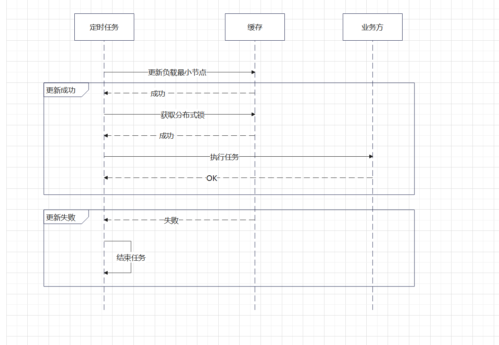
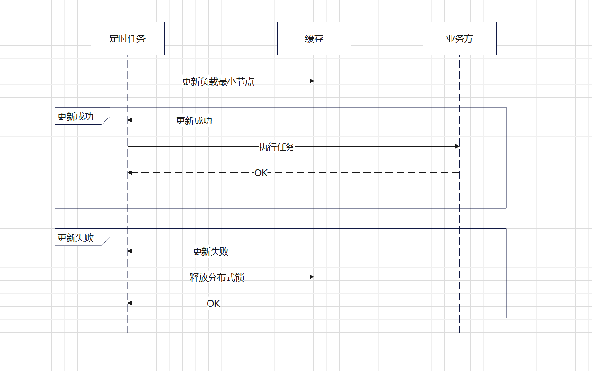

## 代码路径
internal/job/ranking_job.go:52

## 设计思路
通过redis存储负载最小的节点，每个节点尝试获取分布式锁前，先尝试更新redis中存储的负载最小的节点
。如果更新成功（比当前节点比redis中存储的节点负载小或redis中存储的节点就是当前节点）则获取分布式锁，执行任务.
更新失败则放弃此次执行任务
### UML

节点未持有分布式锁

节点已持有分布式锁

## 极端情况分析
1、没有可能选中最差的节点？

有可能，一开始redis中还未存储最小负载节点，此时任何节点先尝试更新redis中的最小负载节点，就会将自己最为最小负载节点保存到redis中去。
如果是负载最大的节点先尝试更新，则会选中最差节点执行任务。

2、如果选中的节点宕机了，会发生什么？

选中节点宕机，如果存在其他节点比redis中存的最小负载节点的负载低，则会尝试获取分布式锁，执行热榜更新任务
如果其他节点比redis中存的最小负载节点的负载高，则等redis中的负载节点过期，才能尝试获取分布式锁，在过期前，不会有节点执行热榜更新任务。